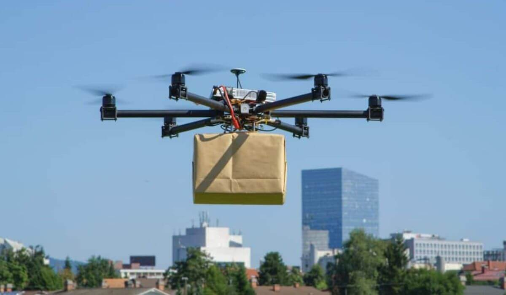

# SAED - Sistema Automático de Entrega de Drone

Tema e Funcionalidades - Pretendemos trabalhar em cima do tema de Entregas Automatizadas por Drone, sistemas como esse já existem em alguns países, mas ainda poder ser muito otimizados.
Nos EUA utilizam entrega por "carrinhos", oque é bem mais vulnerável e ineficiente, a distância que um drone cobre é menor, a velocidade é maior e o gasto de energia pode ser até menor se feito de forma eficiente.
As rotas podem ser traçadas previamente utilizando um sistema de "Estações de Entrega" oque permitiria muito mais segurança e facilidade de manutenção. Sem um piloto 100% automático os drones voam com mais facilidade, sem precisar desviar de prédios ou árvores e sem precisar ir a 200M de altura, oque geraria um bom gasto de energia, além de que o sistema de estações permite que não haja a necessidade de analisar o local de pouso e nem tomar cuidado com pedestres.
Para o futuro, poderíamos automatizar 100%, eliminando as estações e pousando direto no destino. 
Com baterias melhores, a ineficiência de subir mais alto que os prédios e fazer uma linha reta até o destino seria cortada da equação, fazendo o serviço ser mais simples.

## Alunos integrantes da equipe

* [Davi de Victor Gonçalves Rodrigues](https://github.com/Davi-de-Victor)
* [João Obregon Gonçalves Fernandes](https://github.com/aluno2)
* [Rafael de Melo Alves Vilaça](https://github.com/Rafael06-vila)
* [Matheus Souza Costa Neiva](https://github.com/aluno4)

## Professor responsável

* [Felipe Augusto Lima Reis](https://github.com/falreis)

## Gerenciamento do Projeto

Fases do Gerenciamento do Projeto:
1. [Iniciação](docs/01-iniciacao)
2. [Planejamento](docs/02-planejamento)
3. [Execução](docs/03-execucao)
4. [Monitoramento](docs/04-monitoramento)
5. [Encerramento](docs/05-encerramento)

## Apresentação do Trabalho

