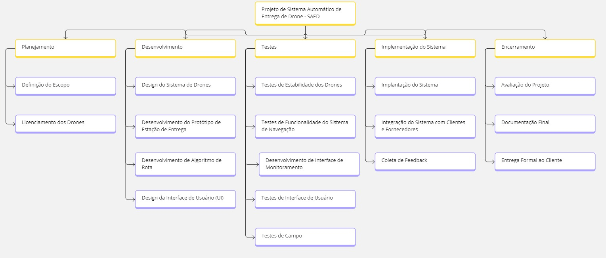
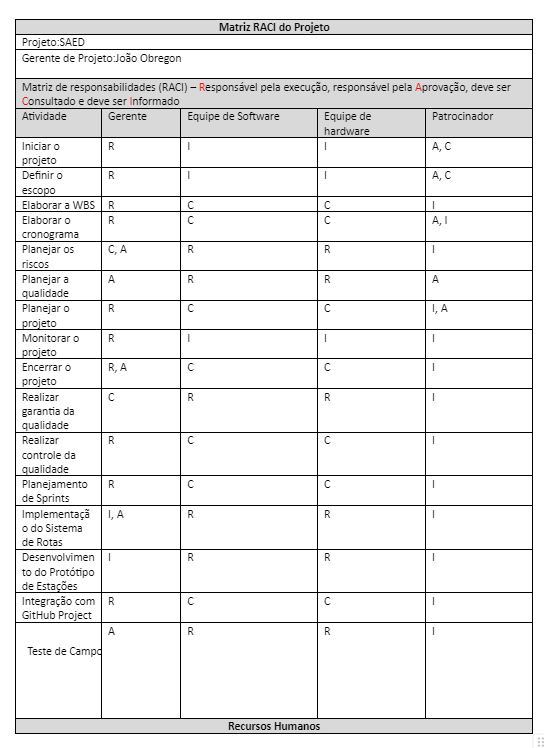
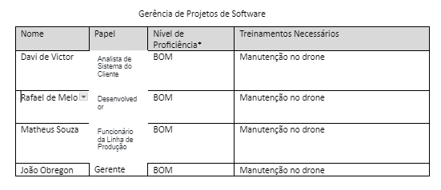
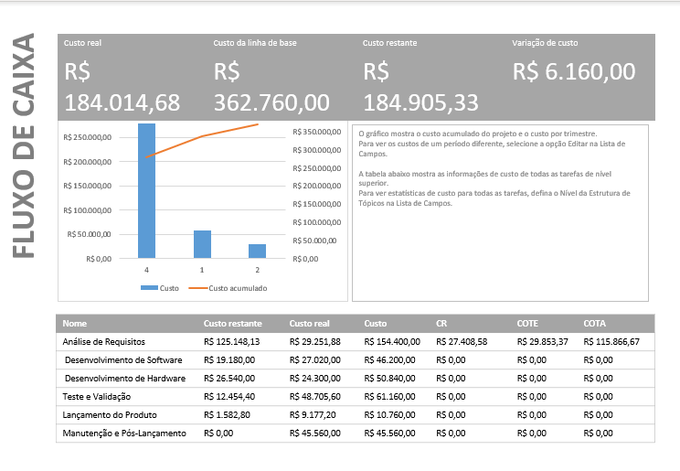
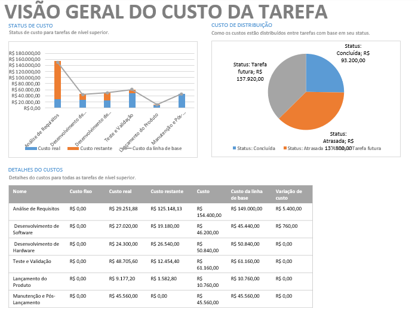
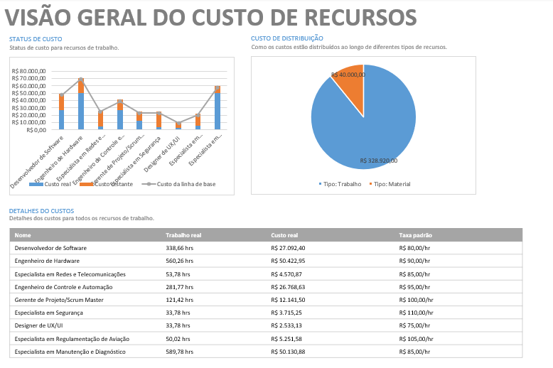
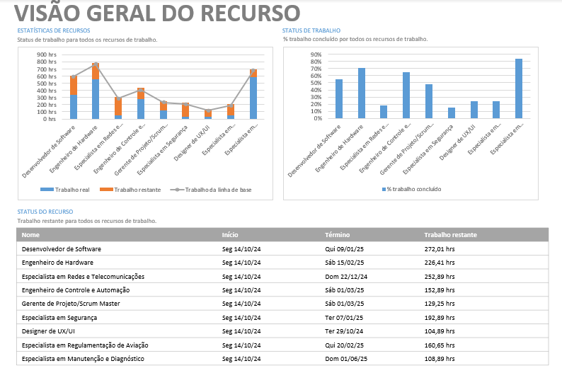
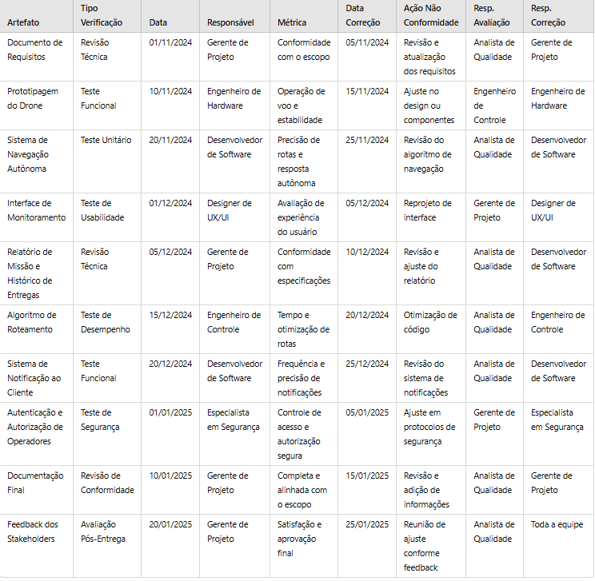

# Planejamento

> A fase de planejamento na gerência de projetos é um momento onde os detalhes do projeto são minuciosamente definidos para garantir uma execução bem-sucedida. 
> Durante essa etapa, os gerentes de projeto e suas equipes elaboram um plano abrangente que aborda aspectos como cronograma, orçamento, recursos necessários, riscos identificados e métodos de controle. 
> O objetivo é criar uma estrutura que guiará as atividades ao longo do projeto, garantindo que metas sejam alcançadas de maneira eficiente. 
> O plano de projeto não apenas define as tarefas específicas e suas interdependências, mas também estabelece critérios de sucesso e indicadores de desempenho. 
> A qualidade do planejamento influencia diretamente a capacidade da equipe em cumprir prazos, alocar recursos eficientemente e lidar com desafios que possam surgir durante a execução.

# Estrutura do Documento

- [Fase de Planejamento](#planejamento)
- [Escopo do Projeto](#escopo-do-projeto)
- [Estrutura Analítica do Projeto](#estrutura-analítica-do-projeto)
- [Matriz de Responsabilidades](#matriz-de-responsabilidades)
- [Cronograma do Projeto](#cronograma-do-projeto)
- [Orçamento do Projeto](#orçamento-do-projeto)
- [Planos de Gerenciamento](#planos-de-gerenciamento)
  - [Plano de Qualidade](#plano-de-qualidade)
  - [Plano de Aquisição](#plano-de-aquisição)
  - [Plano de Comunicação](#plano-de-comunicação)
  - [Plano de Riscos](#plano-de-riscos)

-----
```diff
+ Tarefa 04:
+ Escopo e Estrutura Analítica do Projeto
```

# Escopo do Projeto

> Projeto: Sistema Automático de Entrega de Drone - SAED<br/>
> Objetivo do Projeto: Costrução de um serviço de entrega por drone com o objetivo de aumentar a velocidade de entrega de compras online.

> 1-Desenvolvimento do Sistema de Navegação Autônoma: Criar e configurar o sistema que permita aos drones navegar autonomamente, assegurando que as rotas sejam seguras e otimizadas para eficiência.

> 2-Integração com Estações de Entrega: Implementar a comunicação e integração dos drones com as estações de entrega automatizadas, para garantir a entrega precisa e sem necessidade de intervenção manual.

> 3- Gestão e Otimização de Rotas: Desenvolver um sistema que otimize as rotas dos drones, levando em consideração fatores como clima, trânsito aéreo e eficiência de bateria.

> 4- Monitoramento em Tempo Real: Estabelecer um sistema que permita o monitoramento em tempo real dos drones em operação, oferecendo visibilidade ao operador e ao cliente.

> 5- Gerenciamento de Pacotes e Relatórios: Implementar funcionalidades para a gestão eficiente de pacotes, com geração de relatórios detalhados sobre cada missão e histórico de entregas.

> 6- Notificação ao Cliente: Desenvolver um sistema de notificação que informe os clientes sobre o status da entrega, desde a saída do pacote até a chegada ao destino.

Limites do Projeto:
> * Controle Manual dos Drones: O projeto não incluirá a implementação de controles manuais para a operação dos drones.
> * Integração com Sistemas de Tráfego Aéreo: Não será feita a integração com sistemas de controle de tráfego aéreo.
> * Análise de Terreno para Pouso Direto: O sistema não fará análises detalhadas do terreno para pousos diretos em locais não designados.
> * Operação em Ambientes Rurais ou Isolados: O sistema será projetado para áreas urbanas e não cobrirá operações em áreas rurais ou isoladas.
> * Interação Direta com Clientes Finais: O projeto não prevê a interação direta dos drones com os clientes no momento da entrega.

Restrições:
> * Regulamentações de Aviação e Espaço Aéreo: O projeto deverá estar em conformidade com as regulamentações vigentes para o uso de drones no espaço aéreo.
> * Autonomia Limitada das Baterias: O projeto deve considerar a autonomia de voo limitada pela capacidade das baterias dos drones.
> * Conectividade e Dependência de Rede: A operação dos drones dependerá de uma conexão de rede estável para a comunicação e monitoramento em tempo real.
> * Capacidade de Carga dos Drones: Os drones terão uma capacidade de carga limitada, o que restringirá o tipo de pacotes que podem ser transportados.
> * Clima e Condições Meteorológicas: As operações poderão ser limitadas em condições climáticas adversas, como ventos fortes e tempestades.

Premissas:
> * Assinatura de contrato de prestação de serviços.
> * Apresentação de garantias definidas no contrato.
> * Licenciamento dos drones junto às autoridades reguladoras.
> * Aquisição do hardware necessário para os drones e estações de entrega.
> * Tecnologia de Drones Compatível com os requisitos do projeto.
> * Infraestrutura adequada para as estações de entrega automatizadas.

Marcos Agendados e Entregas

| **Id. do Marco** | **Entregáveis Previstos** |
|------------------|---------------------------|
| **M-1** | Pesquisa e planejamento inicial concluído |
| **M-2** | Protótipo funcional de estação de entrega desenvolvido |
| **M-3** | Sistema de gestão de rotas implementado |
| **M-4** | Testes de campo iniciais realizados com sucesso |
| **M-5** | Interface de monitoramento funcional desenvolvida |
| **M-6** | Piloto em área urbana finalizado com coleta de dados |

# Estrutura Analítica do Projeto



> Softwares recomendados: 
> * [WBS Schedule Pro (Demo)](https://www.criticaltools.com/)
> * [Draw.io](https://app.diagrams.net/)
> * [ProjectLibre](https://www.projectlibre.com/)

### Documento Editável

> Você deve atualiza o seguinte link (ou link correspondente), como o arquivo editável de geração da WBS:
- [Estrutura Analítica do Projeto - Editável](artefatos/estrutura_analitica_projeto.wbs)

```diff
+ Tarefa 04:
+ Fim da seção a ser atualizada.
```

-----
```diff
+ Tarefa 05:
+ Matriz de Responsabilidades (RACI)
```

# Matriz de Responsabilidades





### Documento Editável
https://docs.google.com/document/d/1Mx5rktPTTqeMiJGThjkNq2hLHR2mgfwjywURcFLaSUQ/edit 

```diff
+ Tarefa 05:
+ Fim da seção a ser atualizada.
```

-----
```diff
+ Tarefa 07:
+ Cronograma do Projeto
```

# Cronograma do Projeto

......  DESCREVA EM LINHAS GERAIS O CRONOGRAMA DO SEU PROJETO AQUI ......

> O cronograma do projeto fornece uma representação temporal detalhada de todas as atividades, marcos e eventos ao longo do ciclo de vida do projeto. 
> Elaborado durante o planejamento, o cronograma é uma ferramenta que oferece uma visão das interdependências entre as tarefas, alocando recursos e definindo prazos para as entregas.
> Utilizando técnicas como a análise de rede (PERT/CPM) e estimativas de duração, o cronograma ajuda na identificação de caminhos críticos, permitindo aos gestores de projeto otimizar recursos, antecipar potenciais atrasos e tomar decisões. 
> Além disso, o cronograma serve como um guia para monitorar o progresso, comunicar efetivamente com a equipe e as partes interessadas, e ajustar estratégias para garantir a conclusão bem-sucedida do projeto dentro dos prazos estabelecidos.

### Documento Editável

> Você deve atualiza o seguinte link (ou link correspondente), como o arquivo editável do Cronograma do Projeto:
- [Cronograma e Orçamento do Projeto - Editável](artefatos/cronograma_orcamento.pod)

```diff
+ Tarefa 07:
+ Fim da seção a ser atualizada.
```

-----
```diff
+ Tarefa 08:
+ Orçamento do Projeto
```









```diff
+ Tarefa 08:
+ Fim da seção a ser atualizada.
```

# Planos de Gerenciamento

> Os planos de gerenciamento do projetos consolidam as diretrizes e estratégias para a execução bem-sucedida de um empreendimento. 
> Ele abrange diversos aspectos, como escopo, cronograma, custos, riscos, qualidade, recursos humanos, comunicação e aquisições, proporcionando uma visão abrangente e integrada do projeto. 
> Este plano funciona como um guia mestre que orienta a equipe de projeto e as partes interessadas ao longo do ciclo de vida do projeto, estabelecendo expectativas, responsabilidades e processos. 
> Além disso, serve como um instrumento de comunicação, alinhando as expectativas entre os membros da equipe e as partes interessadas, mitigando riscos e fornecendo uma estrutura sólida para a tomada de decisões. 

```diff
+ Tarefa 09:
+ Checklist de Qualidade
```

## Plano de Qualidade

...... DESCREVA SUCINTAMENTE O PLANO DE QUALIDADE UTILIZADO NO PROJETO ......

> O Plano de Qualidade auxilia a garantir que as entregas do projeto atendam aos padrões de qualidade definidos. 
> Este plano abrange atividades como definição de padrões, procedimentos de garantia de qualidade, critérios de aceitação e processos de monitoramento e controle da qualidade ao longo do ciclo de vida do projeto. 
> Ao identificar metas de qualidade, responsabilidades da equipe, e métricas de avaliação, o Plano de Qualidade busca assegurar que o projeto atinja ou exceda as expectativas dos stakeholders em termos de desempenho e conformidade. 
> A adoção de políticas de qualidade auxilia a mitigar riscos, promove a confiança nas entregas do projeto e, por fim, aumenta a probabilidade de sucesso do empreendimento. 

> Referência - Conceitual
> * https://www.researchgate.net/publication/230636169_Software_Quality_Assurance

> Normas de Qualidade:
> * https://repositorium.uminho.pt/bitstream/1822/27266/1/Tese_MEI_PG19676_Juliana%20Oliveira.pdf
> * https://cin.ufpe.br/~processos/TAES3/Livro/00-LIVRO/07-Normas%20ISO%20e%20Qualidade%20de%20Software-v6_CORRIGIDO.pdf

> Métricas de software:
> * https://repositorio.unicamp.br/Busca/Download?codigoArquivo=489087
> * https://lume.ufrgs.br/bitstream/handle/10183/66095/000870909.pdf?sequence=1
> * https://www.computerweekly.com/br/tip/23-metricas-de-desenvolvimento-de-software-que-devem-ser-monitoradas

> Processos de Garantia da Qualidade de Software
> * https://ceur-ws.org/Vol-3200/paper22.pdf
> * https://citeseerx.ist.psu.edu/document?repid=rep1&type=pdf&doi=d6bd60206282a2d4449e414e81a703612ef78a0c
> * https://www.testbytes.net/blog/quality-assurance-process-methodology/
> * https://www.projectmanager.com/blog/quality-assurance-and-testing

> Você pode utilizar como referência o seguinte documento:
> [Checklist de Qualidade](artefatos/checklist_qualidade.docx)

### Artefatos a serem verificados

| Artefato   | Tipo Verif. | Data        | Responsável | Métrica     | Data Correção | Ação Não Conform. | Resp. Avaliação | Resp. Correção |
|------------|-------------|-------------|-------------|-------------|---------------|-------------------|-----------------|----------------|
|      Documento de Requisitos      |       Revisão Técnica	      |       01/11/2024	      |      Gerente de Projeto       |      Conformidade com o escopo       |       05/11/2024       |       	Revisão e atualização dos requisitos           |        Analista de Qualidade         |      Gerente de Projeto            |
|      Prototipagem do Drone      |       Teste Funcional      |       10/11/2024	      |       Engenheiro de Hardware	      |      Operação de voo e estabilidade       |        15/11/2024	       |         Ajuste no design ou componentes	          |         Engenheiro de Controle	        |        Engenheiro de Hardware
        |
|     Sistema de Navegação Autônoma       |      Teste Unitário	       |      20/11/2024	       |       Desenvolvedor de Software	      |      Precisão de rotas e resposta autônoma       |      25/11/2024	         |          Revisão do algoritmo de navegação         |         Analista de Qualidade	        |        Desenvolvedor de Software        
|
|     Interface de Monitoramento       |       Teste de Usabilidade	      |      01/12/2024	       |      Designer de UX/UI	       |       Avaliação de experiência do usuário	      |        05/12/2024	       |   Reprojeto de interface                |        Gerente de Projeto         |       Designer de UX/UI        
|
|     Relatório de Missão e Histórico de Entregas       |     Revisão Técnica        |     05/12/2024	        |      Gerente de Projeto	       |       Conformidade com especificações	      |        10/12/2024	       |          Revisão e ajuste do relatório         |          Analista de Qualidade       |       Desenvolvedor de Software         |
|      Algoritmo de Roteamento      |       Teste de Desempenho      |      15/12/2024	       |     Engenheiro de Controle	        |       Tempo e otimização de rotas	      |        20/12/2024	       |      Otimização de código             |       Analista de Qualidade          |         Engenheiro de Controle     
|
|      Sistema de Notificação ao Cliente      |      Teste Funcional       |     20/12/2024	        |     Desenvolvedor de Software	        |      Frequência e precisão de notificações	       |      25/12/2024	         |          Revisão do sistema de notificações         |      Analista de Qualidade           |       Desenvolvedor de Software         |
|      Autenticação e Autorização de Operadores      |      Teste de Segurança       |      01/01/2025	       |       Especialista em Segurança	      |       Controle de acesso e autorização segura	      |               |        05/01/2025	           |        Ajuste em protocolos de segurança         |         Gerente de Projeto	     
|
|      Documentação Final      |       Revisão de Conformidade      |       10/01/2025	      |       Gerente de Projeto	      |     Completa e alinhada com o escopo	        |        15/01/2025	       |       Revisão e adição de informações            |         Analista de Qualidade        |       Gerente de Projeto      
|
|      Feedback dos Stakeholders      |       Avaliação Pós-Entrega      |       20/01/2025	      |       Gerente de Projeto	      |      Satisfação e aprovação final       |       25/01/2025	        |    Reunião de ajuste conforme feedback               |        Analista de Qualidade	         |       Toda a equipe
        |


        



### Padrões e Normas Utilizadas

| Nome       | Descrição   | 
|------------|-------------|
|            |             |
|            |             |
|            |             |
|            |             |
|            |             |

### Ambiente das Atividades de Qualidade

| Ambiente   | Descrição   | 
|------------|-------------|
|            |             |
|            |             |
|            |             |
|            |             |

### Equipe de Qualidade

| Nome       | Responsabilidade | 
|------------|------------------|
|            |                  |
|            |                  |
|            |                  |
|            |                  |
|            |                  |

### Metodologias de Qualidade Utilizadas

| Nome       | Descrição   | 
|------------|-------------|
|            |             |
|            |             |
|            |             |

```diff
+ Tarefa 09:
+ Fim da seção a ser atualizada.
```

```diff
+ Tarefa 10:
+ Especificação de Produto para Aquisição
```

## Plano de Aquisição

> O Plano de Aquisições define o processo relacionado à aquisição de bens e serviços necessários para a execução do projeto. 
> Este plano abrange a identificação de necessidades, a seleção de fornecedores, a elaboração de contratos, e a gestão do relacionamento com os fornecedores durante do ciclo de vida do projeto. 
> O Plano de Aquisições visa garantir a aquisição eficiente e eficaz dos recursos necessários, minimizando riscos e custos. 
> Além disso, ele proporciona transparência nas relações com fornecedores, promovendo a conformidade com os prazos estabelecidos e padrões de qualidade. 

### Documento Editável

> Você deve atualiza o seguinte link (ou link correspondente), como o arquivo editável de geração da WBS:
- [Especificação Produto Aquisição - Editável](artefatos/aquisicao_produtos.docx)


```diff
+ Tarefa 10:
+ Fim da seção a ser atualizada.
```

```diff
+ Tarefa 11:
+ Plano de Comunicação
```

## Plano de Comunicação

...... DESCREVA SUCINTAMENTE O PLANO DE COMUNICAÇÃO UTILIZADO NO PROJETO ......

> O Plano de Comunicação estabelece estratégias e diretrizes para facilitar a troca de informações entre os membros da equipe e as partes interessadas. 
> Este plano abrange aspectos como os meios de comunicação, a frequência das atualizações, os canais de distribuição de informações e os responsáveis pela comunicação. 
> Uma comunicação eficiente não apenas previne mal-entendidos e conflitos, mas também fortalece o engajamento da equipe e o apoio das partes interessadas. 
>
> Você pode utilizar como referência o seguinte documento:
- [Plano de Gerenciamento de Comunicação - Editável](artefatos/plano_comunicacao.docx)

### Plano de Comunicação do Projeto

| Entregável                         | Público Alvo | Met. Comunicação | Frequência  | Responsável | 
|------------------------------------|--------------|------------------|-------------|-------------|
| Ata de reunião                     |              |                  |             |             |
| Declaração de escopo               |              |                  |             |             |
| WBS                                |              |                  |             |             |
| Dicionário da WBS                  |              |                  |             |             |
| Cronograma                         |              |                  |             |             |
| Lista de Riscos                    |              |                  |             |             |
| Plano de qualidade                 |              |                  |             |             |
| Plano de projeto                   |              |                  |             |             |
| Relatório de Progresso             |              |                  |             |             |
| Relatório de Aderência ao Processo |              |                  |             |             |
| Checklists de Inspeção             |              |                  |             |             |
|                                    |              |                  |             |             |
|                                    |              |                  |             |             |
|                                    |              |                  |             |             |

> Legenda:
> - Público: a quem se destina a comunicação.
> - Método de Comunicação: e_mail, reunião presencial, reunião virtual, etc.
> - Freqüência: diária, semanal, quinzenal, mensal, etc.
> - Responsável: pessoa responsável pela comunicação.

### Plano de Gerência de Comunicação

> Indique:
> - Ferramentas utilizadas no projeto - adicionar link de acesso às ferramentas
> - Papéis: responsáveis pelas correspondentes no projeto
> - Princípios gerais: indica quais princípios serão adotados no plano de comunicação, como clareza, objetividade, impessoalidade, imparcialidade e cordialidade. Detalhar.
>
> Plano de Gerência de Configuração: definir, em linhas gerais, como (ferramenta) serão controladas e distribuídas as versões e se haverá algum controle de responsabilidades.

- Ferramentas utilizadas:
- - [Ferramenta 01](https://pucminas.br)
  - [Ferramenta 02](https://pucminas.br)
  - [Ferramenta 03](https://pucminas.br)
- Papéis:
- - ...
  - ...
  - ...
- Princípios gerais
- - ...
  - ...
  - ...
  - ...

```diff
+ Tarefa 11:
+ Fim da seção a ser atualizada.
```

```diff
+ Tarefa 12:
+ Riscos do Projeto
```

## Plano de Riscos

......  COLOQUE AQUI O SEU TEXTO ......


> O plano de riscos busca antecipar, avaliar e mitigar os desafios potenciais que podem surgir ao longo do projeto. 
> Este documento estratégico oferece uma visão global dos riscos, categorizando-os e delineando estratégias para lidar com cada uma das possíveis adversidades. 
> Inicialmente, é realizada a identificação detalhada dos riscos, abrangendo desde ameaças imprevistas até oportunidades que podem ser exploradas. 
> Uma vez catalogados, os riscos são avaliados quanto à sua probabilidade de ocorrência e impacto, permitindo a priorização e foco em áreas críticas.
>
> O plano de riscos não apenas destaca os perigos em potencial, mas também estabelece respostas e estratégias de contingência. 
> Isso inclui a definição de ações preventivas para mitigar riscos antes que se materializem, bem como estratégias de mitigação para minimizar seu impacto se ocorrerem. 
> Além disso, a identificação de pontos de monitoramento contínuo ao longo do projeto permite uma resposta ágil às mudanças nas condições do ambiente.
>
> Você pode utilizar como referência o seguinte documento:
- [Plano de Gerenciamento de Riscos - Editável](artefatos/plano_riscos.xls)

| Categoria do Risco  | Descrição do Risco | Impacto       | Risco         | Medidas de Prevenção (Contramedidas) | Medidas de Contingência (Mitigação) | 
|---------------------|--------------------|---------------|---------------|--------------------------------------|-------------------------------------|
|                     |                    |               |               |                                      |                                     |
|                     |                    |               |               |                                      |                                     |
|                     |                    |               |               |                                      |                                     |
|                     |                    |               |               |                                      |                                     |
|                     |                    |               |               |                                      |                                     |
|                     |                    |               |               |                                      |                                     |
|                     |                    |               |               |                                      |                                     |
|                     |                    |               |               |                                      |                                     |
|                     |                    |               |               |                                      |                                     |
|                     |                    |               |               |                                      |                                     |

> Indique:
> Categoria do Risco: *ex.: Cliente, Cronograma, Orçamento, Aquisição de produtos, etc*
> Descrição do Risco: *ex.: Cliente não aparenta ter muito interesse no projeto*
> Impacto: *Baixo / Médio / Alto*
> Risco: *Baixo / Médio / Alto*
> Medidas de Prevenção: *Medidas que devem ser adotadas para evitar que o risco se concretize*
> Medidas de Contingência: *Medidas que devem ser adotadas caso o risco se concretize*
>
> *Obs.: Para determinar o risco considere a seguinte combinação entre Probabilidade e Impacto:

| Probabilidade | Impacto       | Risco         |
|---------------|---------------|---------------|
| Baixo         | Baixo         | Baixo         |
| Médio         | Médio         | Médio         |
| Alto          | Alto          | Alto          |
| Baixo         | Médio         | Médio         |
| Médio         | Baixo         | Médio         |
| Baixo         | Alto          | Médio         |
| Alto          | Baixo         | Médio         |
| Médio         | Alto          | Alto          |
| Alto          | Médio         | Alto          |


```diff
+ Tarefa 12:
+ Fim da seção a ser atualizada.
```

-----


